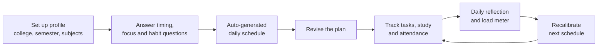
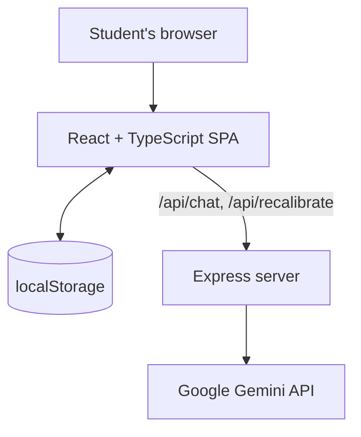

<div align="center">

# PlanZo

### For the student. By the student. To the student.

**An intelligent B.Tech academic and habit companion that keeps your plan, tasks, study material and attendance in one place.**

[**Live Demo**](https://planzo-mu.vercel.app/) ·


</div>


---

## Why PlanZo?

A student doesn't have one problem. They have several small ones at the same time:

| | Problem |
|---|---|
| **Time** | Classes, self-study, assignments, projects and personal life compete for limited hours. |
| **Tasks** | Assignments and deadlines get forgotten or pushed to the last minute. |
| **Resources** | Notes, PDFs, books and links are scattered across different places. |
| **Attendance** | Subject-wise attendance is easy to lose track of until you are close to the **75%** limit. |

The problem isn't a lack of information. It's a lack of organization. PlanZo puts planning, tasks, study resources and attendance in one connected workspace, so the question changes from *"What should I do today?"* to *"Am I on track?"*

## Features

**Plan**
- Guided 6-step setup: profile and college, semester subjects, college timings and focus goals, daily habits, current attendance, then confirmation
- Auto-generated, time-blocked daily routine (lectures, labs, study, habits and chill blocks)
- Monthly academic calendar with date-wise tasks
- **Recalibrate**: missed something? PlanZo rebalances the day, paces heavy study blocks into shorter sprints and adds a restorative buffer
- **Chill Block**: add a break on purpose to avoid burnout

**Tasks**
- Add, check off and snooze tasks without pressure
- Today's adherence, day streak and XP with levels

**Academic Vault (resources)**
- Per-subject folders with tabs for Notes, PYQs, Videos, Assignments, Lab Viva, Syllabus, Important Topics and a Study Planner
- Built-in SATI Vidisha curriculum data, plus a generic B.Tech catalogue (8 semesters, multiple branches)
- Add your own notes to any subject

**75% Attendance Guard**
- Subject-wise attendance with Safe / Warning / At Risk status
- Shows how many classes you can safely skip, or how many you must attend to get back to the target
- **Bunk simulator**: see what skipping the next N classes would do to your percentage
- Optional medical buffer that lowers the target from 75% to 65%

**Wellbeing and focus**
- **Mental Load Meter** estimates how heavy the schedule is, using cognitive weight of blocks and your daily reflection
- Daily reflection (energy, focus, stress)
- Zen Focus timer, Focus Garden, and lo-fi ambience generated in the browser with the Web Audio API
- Dark and light themes

**Sarthi AI Copilot**
- Chat mentor for B.Tech doubts: concepts, code, syllabus topics and attendance rules
- Accepts an attached image or document (for example a question paper or lab diagram)
- Uses your college, branch, semester and current schedule load as context

## Screenshots

| Today's time-blocked schedule | 24-hour allocation and exam countdowns |
|---|---|
|  |  |

## How it works



### Attendance maths

With `attended` classes out of `total`, and a target fraction `t` (0.75 by default):

- If `attended / total >= t`, safe skips = `floor(attended / t - total)`
- Otherwise, classes you must attend in a row = `ceil((t * total - attended) / (1 - t))`

## Tech stack

| Layer | Technology | Used for |
|---|---|---|
| Frontend | React 19, TypeScript | Single-page app UI and state (React Context) |
| Build | Vite | Dev server and production build |
| Styling | Tailwind CSS 4 | Layout, themes (dark and light) |
| UI extras | Motion, lucide-react, canvas-confetti | Animations, icons, celebrations |
| Backend | Node.js, Express, `tsx` | API routes and dev server (`server.ts`) |
| AI | Google Gemini via `@google/genai` | Sarthi AI chat and schedule suggestions |
| Storage | Browser `localStorage` | Profile, timetable, tasks, attendance, XP and streak |
| Audio | Web Audio API | Synthesized lo-fi ambience, no audio files |
| Hosting | Vercel | Static build with SPA rewrites |

### Architecture



### Project structure

```
.
├── server.ts            # Express API (+ Vite middleware in dev)
├── vercel.json          # Vercel build and SPA rewrite config
├── src/
│   ├── App.tsx          # View switcher and layout
│   ├── context/         # AppContext: global state, attendance maths, XP, recalibration
│   ├── components/      # Views: Overview, Routine, Academic Vault, Attendance, Analytics, Sarthi AI, Settings...
│   ├── services/        # sarthiChatService (AI chat client)
│   ├── data/            # SATI Vidisha and generic B.Tech curriculum data
│   ├── utils/           # Web Audio helpers
│   └── types/           # Shared TypeScript types
└── docs/                # Screenshots and pitch deck
```

## Getting started

**Prerequisites:** Node.js and a [Gemini API key](https://aistudio.google.com/apikey) (only needed for the AI features).

```bash
# 1. Clone and install
git clone https://github.com/<your-username>/<your-repo>.git
cd <your-repo>
npm install

# 2. Add your API key
cp .env.example .env
# then edit .env and set GEMINI_API_KEY

# 3. Run (Express + Vite on http://localhost:3000)
npm run dev
```

| Script | What it does |
|---|---|
| `npm run dev` | Starts the Express server with Vite middleware on port 3000 |
| `npm run build` | Production build into `dist/` |
| `npm run preview` | Serves the built frontend only (no AI routes) |
| `npm run lint` | Type-checks with `tsc --noEmit` |

### Environment variables

| Variable | Required | Description |
|---|---|---|
| `GEMINI_API_KEY` | For AI features | Server-side key for Sarthi AI and schedule suggestions. Never commit it. |
| `APP_URL` | No | Hosting URL, used when deployed on AI Studio |

### API routes

| Route | Purpose |
|---|---|
| `GET /api/chat` | Health check for the AI server |
| `POST /api/chat` | Sarthi AI chat (text plus optional image or document) |
| `POST /api/recalibrate` | Short reassuring summary when a schedule is rebalanced |
| `POST /api/syllabus-planner` | Study roadmap for a subject (server route is ready, not yet used by the UI) |

## Data and privacy

PlanZo has no database. Your profile, schedule, tasks, attendance, XP and streak are stored in your browser's `localStorage`, and Settings lets you export your data as JSON. Messages you send to Sarthi AI are forwarded by the server to the Gemini API.

## Current status and known limitations

PlanZo started as a student-built prototype, so some parts are still in progress. These are good places to contribute:

- Accounts are local to the browser (no real authentication or cloud sync yet)
- "University portal sync" is a guided demo using built-in curriculum data, not live scraping
- Analytics charts and insight cards currently use sample data
- Subject resources are seeded samples plus notes you add; there is no file storage yet
- On the Vercel deployment the frontend is static, so Sarthi AI needs a reachable backend
- `/api/syllabus-planner` is not connected to the Study Planner tab yet

## Roadmap

- [x] Setup wizard, auto-generated routine and recalibration
- [x] 75% Attendance Guard with bunk simulator
- [x] Academic Vault, XP and streaks, Zen Focus
- [x] Sarthi AI copilot
- [ ] Analytics driven by real tracked data
- [ ] Cloud accounts and sync
- [ ] Wire the syllabus planner to the AI route
- [ ] Course-specific resources for more universities
- [ ] Community contributions for curricula and study material

## Contributing

Contributions from students are very welcome.

1. Fork the repo and create a branch: `git checkout -b feature/your-idea`
2. Make your change and run `npm run lint`
3. Open a pull request describing what you changed and why

Adding curriculum data for your college (see `src/data/`) is a great first contribution.

## Acknowledgements

Built at SATI, Vidisha, and presented at the AAROHAN 2026- Prarupam 2.0- Prototype Competition, SGSITS, Indore.

---

<div align="center">

**PlanZo turns student chaos into a plan.**

*For the student. By the student. To the student.*

</div>
